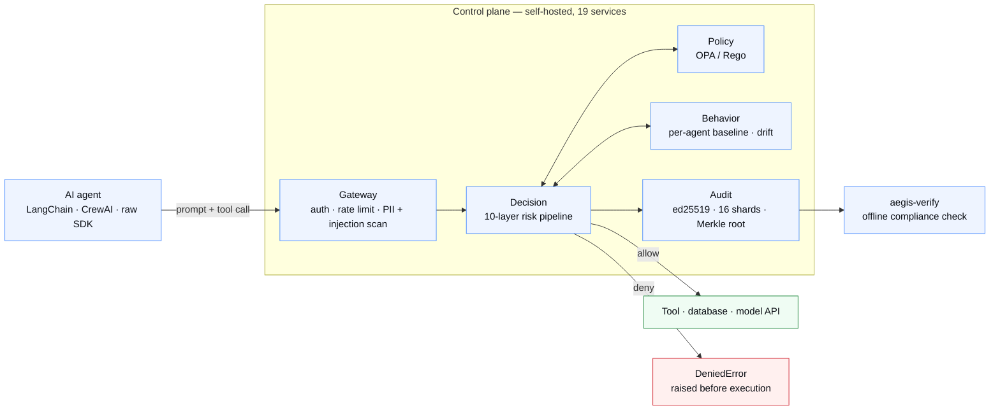
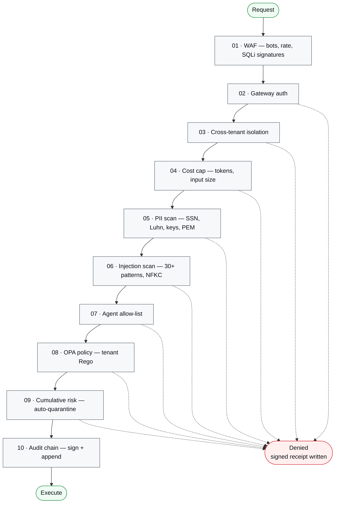

<div align="center">

# Suresh Babu Avula

<a href="https://github.com/sureshavulaaiarchitect">
  
</a>

</div>

---

I work on the layer most teams discover too late: the data model underneath a billion-dollar product, the database that has to survive a cloud migration, and — lately — the policy plane that decides whether an autonomous agent is allowed to run the tool call it just generated.

Currently enterprise architect for retail AI data platforms at **Impact Analytics**. Previously Innovaccer, FourKites, S&P Global, EY, HP, Citi, IBM.

---

## opa-policy-engine

**A runtime security control plane for AI agents.** &nbsp;[`repo →`](https://github.com/sureshavulaaiarchitect/opa-policy-engine)

[](https://github.com/sureshavulaaiarchitect/opa-policy-engine/blob/main/LICENSE)
[](https://pypi.org/project/aegis-anthropic/)


An agent framework will happily execute a tool call constructed from a prompt-injected model response. Nothing in the stack sits between *"the model said so"* and *"the database was dropped."* This does.

Every prompt is scanned. Every tool call is authorized against a ten-layer pipeline backed by Open Policy Agent. Every decision is written to an ed25519-signed, Merkle-rooted audit chain that a regulator can verify offline, without calling me. Self-hosted, model-agnostic, tool-agnostic — prompts never leave the deployment.

### Architecture



### The ten layers

Each has its own status code, its own reason string, and an explicit fail mode. Nine of the ten fail **closed**.



### Integration is one decorator

```python
from sdk.acp_client import Client, DeniedError

acp = Client()

@acp.protect(agent_id="agent_42", tool="db.query")
def query(sql: str) -> list[dict]:
    return db.execute(sql)

query("SELECT name FROM users LIMIT 10")   # runs
query("DROP TABLE users")                  # DeniedError — before execution
```

### What's measured

|  |  |
|---|---|
| **Detection** | 88.7% recall · 98.6% precision across 123 adversarial payloads |
| **Integrity** | 0 audit-chain violations · 100% block rate on PII, cost, and scope classes |
| **Latency** | ~150 ms deny path · ~440 ms allow path, before model inference |
| **Resilience** | 16 s fail-closed recovery under a Decision-service chaos kill |
| **Footprint** | 19 FastAPI services + 6 infra containers · ~$290/mo on AWS · $0 on Docker Compose |
| **Distribution** | 5 PyPI packages · Terraform to a full AWS topology · Apache 2.0 |

The threat model, chaos results, scalability sweep to 2,000 concurrent workers, and the itemized AWS bill are all in the [16-section test report](https://github.com/sureshavulaaiarchitect/opa-policy-engine/tree/main/docs/testing) — published, not summarized.

---

<!--
  Two more repos in the same shape. The pattern that works:
    what breaks without it → what it does → how it's built → what's measured.
  A diagram earns its place when the system has more than three moving parts.
  Delete these slots rather than filling them with anything thin.
-->


---

## Engineering focus

**Data & database architecture** — end-to-end ownership from business semantics through logical modeling to physical implementation and 24×7 operations. OLTP, OLAP, in-memory, search, and lakehouse workloads designed together rather than as separate silos.

**Multi-cloud database engineering** — relational, NoSQL, in-memory, and search stores across AWS, Azure, GCP, OCI, and on-prem. Migrations, HA/DR topology, connection-pool and query-path tuning, reliability practice built from zero.

**Applied AI engineering** — RAG over operational knowledge (pgvector, ChromaDB, Ollama), MCP servers exposing databases to agents, and the governance layer that makes agentic systems auditable enough to run in a regulated enterprise.

**FinOps** — workload right-sizing, AI-assisted query optimization, and enterprise EDP/MAP negotiation. Roughly $40M in cumulative multi-year cloud spend removed across AWS and Azure programs.

---

## Selected work

| Where | What I owned |
|---|---|
| **Impact Analytics** · 2026– | Data architecture for retail AI products on GCP — high-throughput ingestion and columnar analytics on ClickHouse and OceanBase |
| **Innovaccer** · 2021–2025 | Built the database reliability engineering function; healthcare analytics serving hundreds of thousands of concurrent users, Snowflake data products over millions of patient records daily |
| **FourKites** · 2019–2021 | PostgreSQL, Cassandra and Redis direction for real-time supply-chain visibility on an event-driven architecture; time-series at scale |
| **Ernst & Young** · 2018–2019 | OpenShift platform architecture for the Andhra Pradesh government's e-Pragathi digital-governance program |
| **S&P Global** · 2016–2018 | Fintech-grade database infrastructure and the Helix infrastructure-as-code platform for on-prem-to-cloud migration |
| **HP · Citi · IBM** · 2010–2016 | 100+ Oracle RAC and DR builds; the HPI/HPE corporate separation across multiple datacenters; banking integration programs across APAC, EMEA, Japan and the US |

---

## Stack

**Databases** &nbsp;PostgreSQL · Oracle · MySQL · MongoDB · Cassandra · Redis · Elasticsearch
**Analytics** &nbsp;Snowflake · BigQuery · Redshift · Databricks · ClickHouse · SingleStore · OceanBase
**Data engineering** &nbsp;dbt · Airflow · Kafka · Delta Lake · Apache Iceberg
**Cloud & platform** &nbsp;AWS · GCP · Azure · OCI · Kubernetes · OpenShift · Terraform · Ansible · Docker
**AI** &nbsp;RAG · MCP servers · LangChain · Ollama · pgvector · ChromaDB · Open Policy Agent
**Observability & FinOps** &nbsp;Prometheus · Grafana · Datadog · Splunk · Apptio Cloudability

MCA, JNTU Hyderabad &nbsp;·&nbsp; AWS Solutions Architect – Associate &nbsp;·&nbsp; Oracle Certified Professional 11g &nbsp;·&nbsp; PMP &nbsp;·&nbsp; ITIL V3

---

Open to conversations about enterprise data architecture, agentic AI security, and cloud cost engineering.

[**LinkedIn**](https://www.linkedin.com/in/YOUR-LINKEDIN-HANDLE) &nbsp;·&nbsp; [**sureshbabuavula@gmail.com**](mailto:sureshbabuavula@gmail.com) &nbsp;·&nbsp; Hyderabad, India
